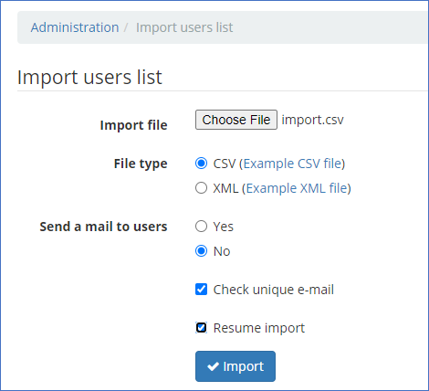
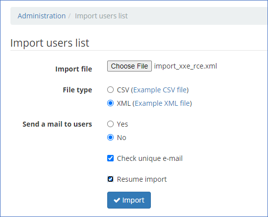
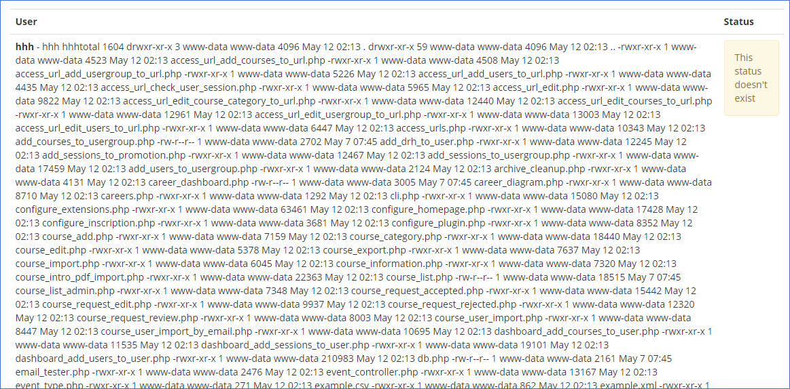
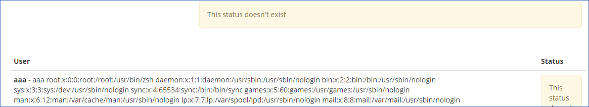

# Chamilo LMS 1.11.14 Vulnerabilities Write-up
## Overview
In the past week I've looked deeper into [Chamilo LMS](https://github.com/chamilo/chamilo-lms) to work on my white-box skills and found following vulnerabilities which I reported to the vendor:

## Authenticated RCE/LFI via XML External Entity - CVE-2021-32925

Authenticated admins can trigger in-band Local File Inclusion or, if "expect" installed, Remote Code Execution when importing users using XML file. 

### How to reproduce
Because of some issue, first a dummy CSV import needs to be done in order to see the in-band errors later:

After that, the XML can be uploaded:

The import will fail, but the error message will contain in-band XXE RCE output if expect wrapper is installed (in the example, ls -la is executed):

Another example is to load inband `/etc/passwd` file:

### Mitigation
Update to the latest release of Chamilo LMS. Following is the specific fix - Commit [e71437c8de809044ba3ae1b181d70857c050a3e9](https://github.com/chamilo/chamilo-lms/commit/e71437c8de809044ba3ae1b181d70857c050a3e9)

### Timeline
2021-05-12 Reported to vendor
2021-05-12 Fixed by vendor (in less than 9 hours)
2021-05-13 Requested CVE ID by me
2021-05-14 Issued [CVE-2021-32925](https://cve.mitre.org/cgi-bin/cvename.cgi?name=cve-2021-32925)
