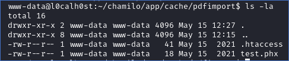

# Chamilo LMS 1.11.x Vulnerabilities Write-up ## Overview In the past week I've looked deeper into [Chamilo LMS](https://github.com/chamilo/chamilo-lms) to work on my white-box skills and found some vulnerabilities which I reported to the vendor:

## Authenticated RCE/LFI in user import via XML External Entity - CVE-2021-32925

Affected versions: 1.11.x
Authenticated admins can exploit XEE vulnerability and trigger in-band Local File Inclusion when importing users using XML file on multiple places. If [expect wrapper](https://www.php.net/manual/en/wrappers.expect.php) is installed on the target box, code can be executed remotely.

### How to reproduce

Following example shows how to exploit the vulnerability in '/main/admin/user_import.php'. Because of an unknown issue a dummy CSV file needs to be imported to see the in-band errors later:

After that, the XML with XEE payload can be uploaded:

The import will fail, but the error message will contain in-band XEE RCE output if expect wrapper is installed (in the example, ls -la was executed):

Another example is to load inband `/etc/passwd` file using LFI:

### Mitigation
Update to the latest release of Chamilo LMS. Following is the specific fix - Commit
[e71437c8de809044ba3ae1b181d70857c050a3e9](https://github.com/chamilo/chamilo-lms/commit/e71437c8de809044ba3ae1b181d70857c050a3e9)

### Timeline
- 2021-05-12 Reported to vendor
- 2021-05-12 Fixed by vendor (in less than 9 hours)
- 2021-05-13 Requested CVE ID by me
- 2021-05-14 Issued [CVE-2021-32925](https://cve.mitre.org/cgi-bin/cvename.cgi?name=cve-2021-32925)

### References
- https://support.chamilo.org/projects/1/wiki/Security_issues#Issue-58-2021-05-12-High-impact-very-low-risk-LFIRCE-vulnerability-in-users-import
- https://cve.mitre.org/cgi-bin/cvename.cgi?name=cve-2021-32925

## Unauthenticated SQL Injection in "compilatio" module

Affected versions: 1.11.14
There is a SQL Injection vulnerability that allows unauthenticated attackers to run arbitrary queries when the system has „compilatio“ enabled. The issue is in `main/plagiarism/compilatio/upload.php`, where the `doc` parameter isn't properly santitized:

and is later included directly into the sql query string:

### How to reproduce

An example attack URL is http://chamilo/main/plagiarism/compilatio/upload.php?doc=123%20or%20sleep(10);--#

### Mitigation
Update to the latest release of Chamilo LMS. Following is the specific fix - Commits [36149c1ff99973840a809bb865f23e1b23d6df00](https://github.com/chamilo/chamilo-lms/commit/36149c1ff99973840a809bb865f23e1b23d6df00) and [f398b5b45c019f873a54fe25c815dbaaf963728b](https://github.com/chamilo/chamilo-lms/commit/f398b5b45c019f873a54fe25c815dbaaf963728b)

### Timeline
- 2021-05-13 Reported to vendor
- 2021-05-13 Fixed by vendor

### References
- https://support.chamilo.org/projects/1/wiki/Security_issues#Issue-59-2021-05-13-High-impact-low-risk-Unauthenticated-SQL-injection-vulnerability-when-a-module-is-enabled

## Admin authenticated SQL injection vulnerability in sessions

Affected versions: 1.11.x
Another SQL Injection vulnerability which allows authenticated admins to run arbitrary queries and receive in-band responses.

The vulnerable endpoint is at `/main/session/session_add.php`.

The `xajaxargs[]` parameter should contain the payload, which will do union select to leak username, password and salt from the users table. (The query needs to be NULL-byte terminated to pass syntax checks). 

The search parameter is passed to the `seach_coachs` function, which doesn’t escape it via `Database::escape_string` before using it in the SQL string:

### How to reproduce

Pass null-byte terminated argument in the `xajaxargs[]` parameter:

### Mitigation
Update to the latest release of Chamilo LMS. Following is the specific fix - Commit [93ed46451927dd7d5826cde9e08a2b438b9220e0](https://github.com/chamilo/chamilo-lms/commit/93ed46451927dd7d5826cde9e08a2b438b9220e0)

### Timeline
- 2021-05-13 Reported to vendor
- 2021-05-14 Fixed by vendor

### References
- https://support.chamilo.org/projects/1/wiki/Security_issues#Issue-60-2021-05-13-High-impact-very-low-risk-SQL-injection-vulnerability-in-sessions-requires-admin-perms

## Multiple stored cross-site scripting vulnerabilities

Affected versions: 1.11.x

There were multiple stored XSS vulnerabilities found

### How to reporoduce

**XSS01 The course name is vulnerable to stored XSS (admin access required)**

Course title doesn’t have double quotes properly escaped, therefore it’s possible to inject XSS as the title is displayed as alt for images.

Payload for title is: `test1xxxxx" onload="alert(1)`

Which triggers in `/user_portal.php`:

and also in '/index.php':

and '/main/auth/sort_my_courses.php':

and finally also on the login screen:

**XSS02 The course description and title are vulnerable to stored XSS (teacher access required)**
Course description can be simply edited in the source code mode and xss code added. The title is vulnerable as well

It will trigger for title:

and for description:

The code gets triggered also in the student view:

**XSS03 XSS in course documents (student access required)**

Not disclosing as fix will be provided in version 2.0

**XSS04 Document upload – Title is vulnerable to XSS**

When documents are uploaded, the title isn't properly sanitized

Triggers when Documents are listed:

### Mitigation
Update to the latest release of Chamilo LMS. Following are is the specific fixes:
- XSS1 by commit[fd54f6194285f949c86060d3b2a7967b43689480](https://github.com/chamilo/chamilo-lms/commit/fd54f6194285f949c86060d3b2a7967b43689480)
- XSS2 by commit[19189a91d1eac9aa204b9439b82e3e73c8ac2e03](https://github.com/chamilo/chamilo-lms/commit/19189a91d1eac9aa204b9439b82e3e73c8ac2e03)
- XSS4 by commit[cf84be1ca1d9a08ad1341dfbf8df475b13a89072](https://github.com/chamilo/chamilo-lms/commit/cf84be1ca1d9a08ad1341dfbf8df475b13a89072)

### Timeline
- 2021-05-14 Reported to vendor
- 2021-05-14 Fixed by vendor

### References
- https://support.chamilo.org/projects/1/wiki/Security_issues#Issue-61-2021-05-14-Low-impact-very-low-risk-XSS-in-course-name
- https://support.chamilo.org/projects/1/wiki/Security_issues#Issue-62-2021-05-14-Low-impact-low-risk-XSS-in-course-description
- https://support.chamilo.org/projects/1/wiki/Security_issues#Issue-63-2021-05-14-Low-impact-moderate-risk-XSS-in-course-documents
- https://support.chamilo.org/projects/1/wiki/Security_issues#Issue-64-2021-05-14-Low-impact-low-risk-XSS-in-course-document-title-on-upload

## Unauthenticated SQL Injection #2 in plugin

Affected versions: 1.11.x
There is a plugin with its own web service, which has the authentication vulnerable to SQL injection in password parameter (plugin doesn’t need to be enabled to trigger the SQL injection).

### How to reproduce

An example attack URL is http://chamilo/main/plagiarism/compilatio/upload.php?doc=123%20or%20sleep(10);--#

### Mitigation
Update to the latest release of Chamilo LMS. Following is the specific fix - Commit [6a98e32bb04aa66cbd0d29ad74d7d20cc7e7e9c5](https://github.com/chamilo/chamilo-lms/commit/6a98e32bb04aa66cbd0d29ad74d7d20cc7e7e9c5)

### Timeline
- 2021-05-15 Reported to vendor
- 2021-05-17 Fixed by vendor

### References
- https://support.chamilo.org/projects/1/wiki/Security_issues#Issue-65-2021-05-15-High-impact-very-high-risk-Unauthenticated-SQL-injection-in-plugin

## Authenticated Remote Code Execution in import file

Affected versions: 1.11.x

It is possible to upload zip-file containing .htaccess file to the course_intro_pdf_import.php import

### How to reproduce

The contents of the zip-file:

contents of `test.phx` - php code to execute:

`.htaccess` with add php handler for `.phx` file extensions:

Upload to `/main/admin/course_intro_pdf_import.php`:

The contents of the zip file will be put in folder `/var/www/chamilo/app/cache/pdfimport`:

And the .phx code can be executed by calling `/app/cache/pdfimport/test.phx`

### Mitigation
Update to the latest release of Chamilo LMS. Following is the specific fix - commits [2e5c004b57d551678a1815500ef91524ba7bb757](https://github.com/chamilo/chamilo-lms/commit/2e5c004b57d551678a1815500ef91524ba7bb757), [8ba572397445477d67ca55453fd8f29885bb19e5](https://github.com/chamilo/chamilo-lms/commit/8ba572397445477d67ca55453fd8f29885bb19e5), [905a21037ebc9bc5369f0fb380177cb56f496f5c](https://github.com/chamilo/chamilo-lms/commit/905a21037ebc9bc5369f0fb380177cb56f496f5c)

### Timeline
- 2021-05-15 Reported to vendor
- 2021-05-17 Fixed by vendor
- 2021-05-19 Reported another attack vector (race condition)
- 2021-05-20 Fixed by vendor

### References
- https://support.chamilo.org/projects/1/wiki/Security_issues#Issue-66-2021-05-21-High-impact-very-low-risk-Authenticated-RCE-in-accessory-script
